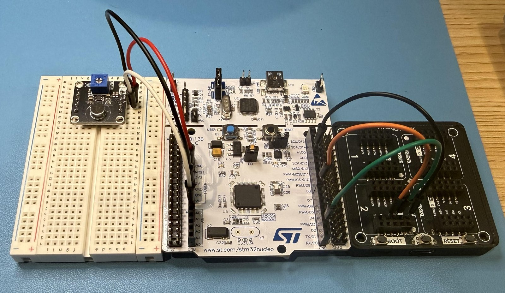
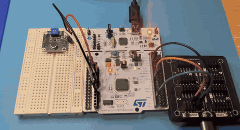
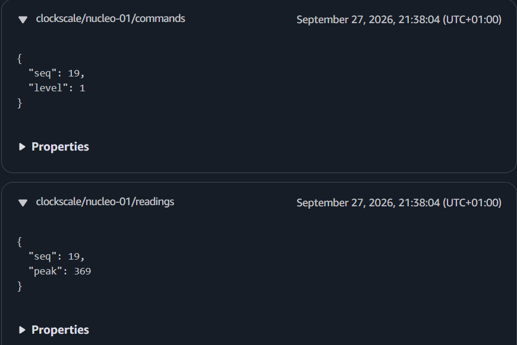

# Cloud-Controlled Clock Scaling — STM32 + AWS IoT

[](https://github.com/JehadAbdelBaqi/cloud-clock-scaling/actions/workflows/ci.yml)

Cloud-driven **dynamic frequency scaling** for a bare-metal STM32F411
(Cortex-M4). The board samples sound through its ADC and reports the level
over MQTT to AWS IoT Core; a Lambda decides the clock level and publishes a
command back; the firmware switches SYSCLK at runtime between the internal
16 MHz oscillator and the PLL (50 MHz) — adjusting flash wait-states and
UART baud rates on every switch — then returns to 16 MHz on its own after a
hold time.



*Left to right: analog mic module · STM32 Nucleo-F411RE · ESP32-S3 Wi-Fi bridge.*

> **Status:** working end to end on real hardware. Next: measuring the
> round-trip latency on an oscilloscope — see [Roadmap](#roadmap).

## Demo



*A finger snap by the mic → the bridge blinks **blue** (reading sent) then
**green** (command back) → the Nucleo's LED blinks fast (50 MHz) → about 5 s
later it's back to slow (16 MHz). A second snap speeds it up again.*

The same round trip in the AWS IoT **MQTT test client** — the reading going up
and the Lambda's command coming back, same `seq`, same second:



## How it works

1. **Listen** — the Nucleo reads an analog mic on its ADC and measures
   loudness as peak-to-peak over short windows.
2. **Report** — any loud noise above a threshold is sent straight away
   (plus a regular reading every 30 s) as a text line over UART to a Wi-Fi
   bridge, which publishes it to AWS IoT Core over MQTT/TLS.
3. **Decide** — an IoT rule invokes a Lambda, which maps the loudness to a
   clock level and publishes a command to the device's topic.
4. **Switch** — the command comes back through the bridge; the firmware
   raises flash wait-states, moves SYSCLK onto the PLL at 50 MHz, recomputes
   its UART baud dividers and acknowledges.
5. **Fall back** — after the hold time the board switches back to 16 MHz
   by itself, whether or not the cloud is reachable.

### What counts as a "loud noise"

The mic module outputs a voltage that swings up and down with the sound
wave, around a steady middle level. The ADC reads it as a 12-bit number:
0–4095 for 0–3.3 V (≈ 0.8 mV per step).

- **Loudness** = the **peak-to-peak** of those readings over one window of
  256 samples (a few ms): highest reading − lowest reading. Silence gives a
  small number; a louder sound swings further and gives a bigger one.
- **Loud noise** = a window with loudness **≥ 100** (≈ 80 mV of swing) —
  `MIC_CLAP_LEVEL` on the board, the same value as `medThreshold` in the
  cloud, so every loud noise the board sends gets a 50 MHz command back.
- The number depends on the mic module's **GAIN** trimmer and how far the
  sound is from the mic — 100 is a starting point to calibrate against
  real quiet vs loud readings.

## Why

**Dynamic frequency scaling** — run the CPU slow when idle to save power,
speed it up only when there's work to do. This project drives that decision
from the cloud, end to end:

- **Embedded:** bare-metal STM32 (register-level, no HAL) — PLL
  reconfiguration, flash wait-states, ADC, UART, SysTick
- **IoT:** device ↔ cloud round trip over MQTT, X.509 device identity
- **DevOps:** all AWS resources in CDK, unit-tested; GitHub Actions runs the
  tests and builds the firmware on pushes marked `[ci:run-tests]` (deploys are run by hand)

## Architecture

```
  LOUD NOISE                                         AWS
   │                                       ┌───────────────────────────────┐
   ▼                                       │                               │
 [Analog mic]                              │  IoT Core ── Rule ──► Lambda  │
   │ ADC                                   │   ▲                     │     │
   ▼                                       │   │ readings            │     │
 [STM32 Nucleo-F411RE]  UART   [Wi-Fi  ]   │   │                     ▼     │
   sample → peak ─────────────►[bridge ]─MQTT──┘          picks clock level│
   │                  ◄────────[       ]◄MQTT─── IoT Core ◄── command ─┘   │
   ▼                  command              │                               │
 reconfigure PLL                           │  CloudWatch Logs (history)    │
 SYSCLK 16 / 50 MHz                        └───────────────────────────────┘
 hold timer → back to 16 MHz when quiet
```

| Clock level | SYSCLK | Source |
|-------------|--------|--------|
| LOW | 16 MHz | HSI (internal oscillator) |
| MED | 50 MHz | PLL |

**Edge vs cloud split:** the cloud decides when to speed up; the board is
responsible for dropping back to low speed on its own after a hold time — so
it always returns to its low-power state, even if the network is down.

## Hardware

| Part | Role |
|------|------|
| ST **Nucleo-F411RE** (STM32F411RE, Cortex-M4) | The device |
| Analog microphone module | Sound input — A0 (PA0), ADC1 |
| **Wi-Fi bridge** (ESP32-S3 board) | The Nucleo has no Wi-Fi. A separate UART-to-MQTT bridge project, treated as a black box: the Nucleo sends and receives plain text lines over UART (USART1, D8/D2), the bridge passes them to and from AWS IoT Core — see [docs/wifi-bridge.md](docs/wifi-bridge.md) |

### Wiring

| From | To (Nucleo header) | Signal |
|------|--------------------|--------|
| Mic power | 3V3 | 3.3 V — not 5V, the ADC pin takes up to 3.3 V |
| Mic GND | GND | Ground |
| Mic analog out | A0 (PA0) | ADC1 channel 0 |
| Bridge RX | D8 (PA9) | Nucleo USART1 TX |
| Bridge TX | D2 (PA10) | Nucleo USART1 RX |
| Bridge GND | GND | Common ground |

UART: 115200 baud, 8N1, 3.3 V logic on both sides. The Nucleo's USB (ST-LINK)
powers it, flashes it, and carries the PC log (USART2).

## Documentation

| Doc | What's in it |
|-----|--------------|
| [firmware/README.md](firmware/README.md) | STM32 firmware — layout, drivers, settings, build/upload |
| [infra/cdk/README.md](infra/cdk/README.md) | AWS resources (CDK), settings, deploy |
| [infra/decide-clock-lambda/README.md](infra/decide-clock-lambda/README.md) | The Lambda: the cloud's decision logic |
| [docs/protocol.md](docs/protocol.md) | Message formats: board ↔ bridge ↔ cloud |
| [docs/wifi-bridge.md](docs/wifi-bridge.md) | The Wi-Fi bridge: hardware, what it does, why not ESP-AT, how it was tested |
| [docs/decisions.md](docs/decisions.md) | Design decisions and why |
| [docs/resources.md](docs/resources.md) | Hardware, ST datasheets/manuals, tech stack |
| [docs/how-to/local-testing.md](docs/how-to/local-testing.md) | Running and checking the test programs |

## Repo layout

```
firmware/     STM32 firmware (PlatformIO, bare-metal)
infra/
  cdk/                  AWS CDK app (IoT Core, Lambda, log group)
  decide-clock-lambda/  Lambda: clock-level decision logic
docs/         Message protocol, design decisions, resources, how-to guides
```

## Roadmap

- [x] Clock switcher on the board (16 ↔ 50 MHz)
- [x] AWS infra in CDK (IoT thing/policy/rule, Lambda, log group)
- [x] Wi-Fi bridge publishing readings to IoT Core
- [x] Full round trip: Lambda → command → board switches clock
- [x] Hold timer on the board → back to low speed
- [x] Mic → ADC → loud-noise detection
- [x] GitHub Actions: tests + firmware build on pushes marked `[ci:run-tests]` (no deploy)
- [ ] End-to-end latency measured on an oscilloscope

**Nice to have:** a small LCD on the board showing the current clock speed.

## Running it yourself

What you can do from this repo alone, and what each step adds:

| Goal | Needs |
|------|-------|
| Run the tests | Software only — no hardware, no AWS |
| Build the firmware | + PlatformIO |
| Clock-cycle test on the board | + a Nucleo-F411RE |
| Deploy the cloud side | + an AWS account |
| **Full loop** (loud noise → clock switch) | + a mic module and a **Wi-Fi bridge** ([what it is](docs/wifi-bridge.md)) |

### Prerequisites

**Software**

- [uv](https://docs.astral.sh/uv/) — installs Python 3.12 and every Python
  package from `uv.lock`
- [VS Code](https://code.visualstudio.com/) +
  [PlatformIO](https://platformio.org/install/ide?install=vscode) — builds and
  flashes the firmware, serial monitor
- For deploying only: [Node.js](https://nodejs.org/) + the AWS CDK CLI
  (`npm install -g aws-cdk`), and the
  [AWS CLI v2](https://docs.aws.amazon.com/cli/latest/userguide/getting-started-install.html)
  logged in to your account (e.g. `aws configure sso`)

**Hardware**

- ST **Nucleo-F411RE** + USB cable — the on-board ST-LINK powers it, flashes
  it and carries the PC log
- **Analog microphone module** that runs on 3.3 V (analog output)
- Jumper wires — see [Wiring](#wiring)
- **A Wi-Fi bridge.** The Nucleo has no Wi-Fi, so a second board does all the
  networking: it joins Wi-Fi, holds the device certificate, connects to AWS IoT
  Core over MQTT/TLS, turns the Nucleo's `S,…` lines into readings and the
  cloud's commands into `C,…` lines. **Its code isn't in this repo** — this
  project only relies on its interface. What it must do, and the ESP32-S3
  bridge used here: [docs/wifi-bridge.md](docs/wifi-bridge.md). Message
  formats: [docs/protocol.md](docs/protocol.md).

All commands run from the **repo root** unless they say otherwise.

### 1. Tests (no hardware, no AWS)

```bash
uv sync          # creates .venv, installs from uv.lock (PlatformIO excluded)
uv run pytest    # CDK stack + Lambda tests
```

### 2. Firmware on its own

Open `firmware/` in VS Code → PlatformIO **Build**, then **Upload** (over the
ST-LINK). What runs is picked in `firmware/include/config/app_config.h` — one
at a time:

| Setting | Runs |
|---------|------|
| `IS_LOCAL_TEST = 1` | Clock-cycle test — board alone, no cloud: LD2 blinks slow at 16 MHz, fast at 50 MHz |
| `IS_CLOUD_TEST = 1` | The full loop (step 4) |

Test steps and expected output: [docs/how-to/local-testing.md](docs/how-to/local-testing.md).

### 3. Deploy the cloud side

```bash
aws sso login                         # or however you log in to your account

# 1. Your account's IoT endpoint -> infra/cdk/cdk.json "iotEndpoint"
aws iot describe-endpoint --endpoint-type iot:Data-ATS

# 2. A device certificate. The ARN it prints -> infra/cdk/cdk.json "certificateArn".
#    The certificate and private key files are loaded onto the Wi-Fi bridge —
#    they are not stored in this repo.
aws iot create-keys-and-certificate --set-as-active \
  --certificate-pem-outfile device.pem.crt \
  --private-key-outfile private.pem.key \
  --query certificateArn --output text

# 3. Deploy
cd infra/cdk
cdk bootstrap                         # once per account/region
cdk deploy ClockScaleStack
```

The [Wi-Fi bridge](docs/wifi-bridge.md#device-identity-x509) needs four things from this step: the **endpoint**, the
**certificate** and **private key** above, and
[Amazon's root CA](https://www.amazontrust.com/repository/AmazonRootCA1.pem).

Watch messages arrive: AWS console → IoT Core → **MQTT test client** →
subscribe to `clockscale/#`.

**Settings** (`infra/cdk/cdk.json` → `context`):

| Key | Default | Meaning |
|-----|---------|---------|
| `iotEndpoint` | — | This account's IoT data endpoint |
| `deviceId` | `nucleo-01` | IoT thing name + MQTT client ID (the bridge must connect with it) |
| `certificateArn` | — | Device certificate ARN — not a secret; the private key is kept on the bridge, not in this repo |
| `medThreshold` | 100 | Loudness that gets a 50 MHz command *(to calibrate)* |
| `maxLevel` | 1 | Highest level the cloud sends (1 = 50 MHz) |

More: [infra/cdk/README.md](infra/cdk/README.md).

### 4. The full loop

1. Wire the mic and the bridge to the Nucleo — [Wiring](#wiring).
2. [Wi-Fi bridge](docs/wifi-bridge.md) running and connected to IoT Core (step 3's endpoint, certificate,
   key and root CA, plus your Wi-Fi).
3. Firmware with `IS_CLOUD_TEST = 1`, uploaded.
4. Make a loud noise near the mic: the Nucleo sends a reading, the command
   comes back, LD2 blinks fast (50 MHz), then slow again after the hold time.
   With the Nucleo's serial monitor open you'll see each line — expected
   output in [docs/how-to/local-testing.md](docs/how-to/local-testing.md).
